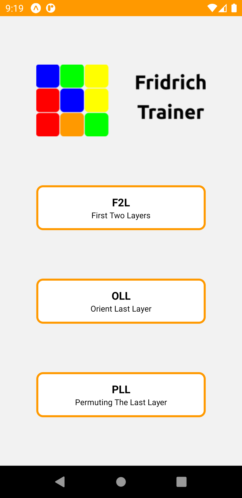
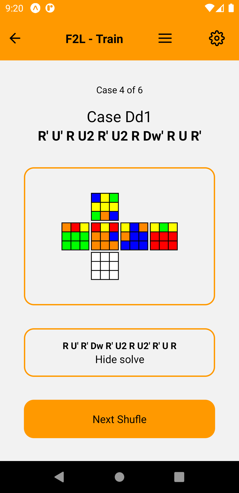
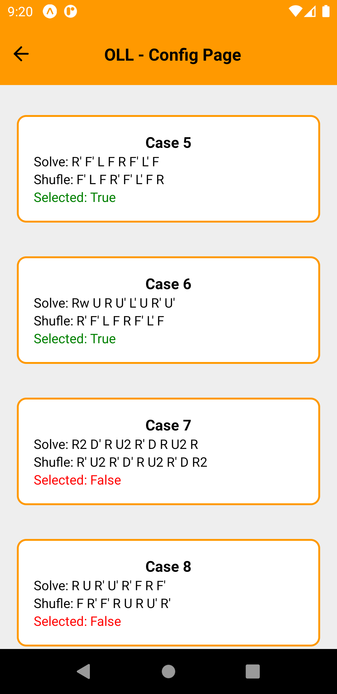
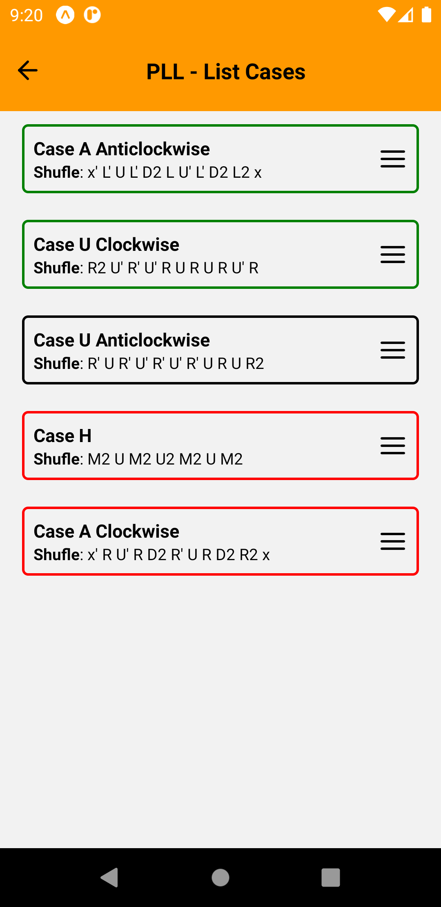
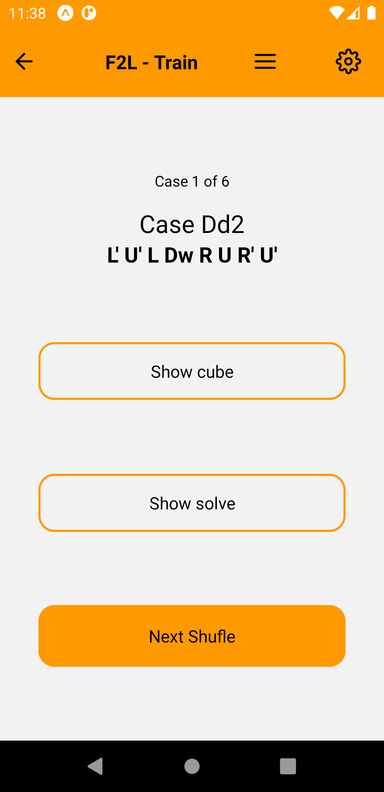
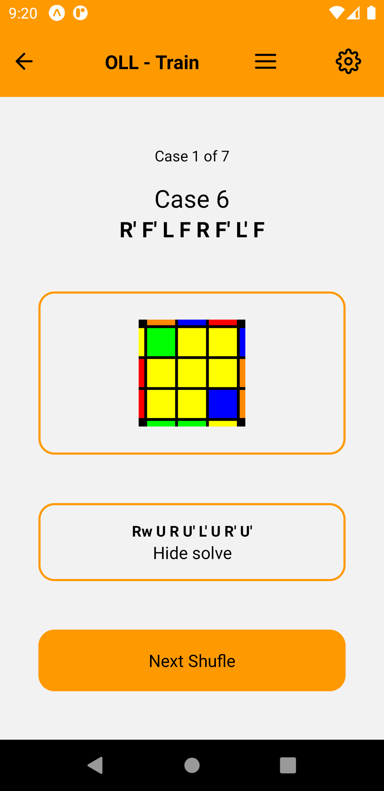
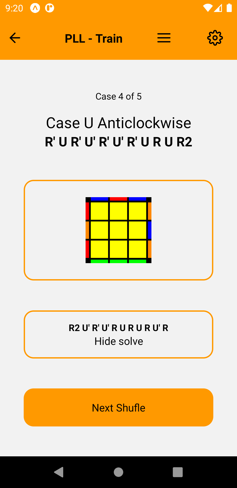

<h1 align="center">
	
</h1>

---

<h2 align="center">
	Fridrich Trainer
</h2>

	Fridrich Trainer is an app to practice the most famous method to solve the Rubik's Cube. To improve since the F2L to the OLL and the PLL. All in one simple and intuitive application. Fridrich Trainer is also an open-source project so is possible anyone help since reporting bugs, writing code, documentation, giving ideas or just checking the <a href="https://www.github.com/Darguima/FridrichTrainer">homepage</a>.

 

	
	
	
	

---

## Table of Contents

- [Getting Started](#getting-started)
- [Pages/Features](#pages/features)
- [Technologies Used](#technologies-used)
- [License](#license)

---

## Getting Started

### Prerequisites

- `Git` to clone the repository;

- `Yarn` to install dependencies;

- For run the project you will need the `Expo` Environment configured. You can follow the [Expo Official Documentation](https://docs.expo.io/get-started/installation/);

- This project was only tested and developed for Android. So I don't know if it works properly in IOS. Is recommended that you run it in an `Android Phone`;

### Cloning

- To start you can clone this repository to your local machine using:

> `git clone https://github.com/Darguima/FridrichTrainer.git`

### Installing Dependencies

- Now you can install all the dependencies with yarn:

> `yarn`

### Setup

- To setup the application you can use:

> `yarn start`

### Running the App

- Finally to run the App you only need to scan the QRCode (you need have the `Expo Go` App on your phone)

---

## Pages/Features

### Landing Page

* Of course we start with the Landing Page
* With a simplistic menu to select one of the three steps of the CFOP.

___

### Train Page

	
	
	
	

* Is there where you will pass the most of the time
* All of the 3 choices have the same layout and workflow, being the only difference the design of the cube simulations
* In the header we 2 buttons to the `Config Page` and to the `List Cases`
* There are also 2 buttons, one to show the cube simulation and other to show the solve

___

### Config Page

* There you can choose what cases do you want that appear on the Train Page.

___

### List Cases

* To can have a little idea of the cases that we already done and whats we will do
* We also can to reorganize the order of the cases

---

## Technologies Used

- core
	- JavaScript/TypeScript
	- React Native
	- Expo

- navigation
	- [React Navigation](https://github.com/react-navigation/react-navigation) - used to navigate between the screens

- storage
	- [Async Storage](https://github.com/react-native-async-storage/async-storage) - to save what cases are selected on the `Config Page`

- others
	- [react-native-draggable-flatlist](https://github.com/computerjazz/react-native-draggable-flatlist) - used to create the `List Cases` page
	- [Cube Simulator](https://github.com/Darguima/CubeSimulator) - used indirectly to create the SVGs to the cube simulations
	- [react-native-svg](https://github.com/react-native-svg/react-native-svg) - used to load the SVGs of the cube simulation

---

## License
This project is licensed under the MIT License - see the [LICENSE](LICENSE) file for details.
